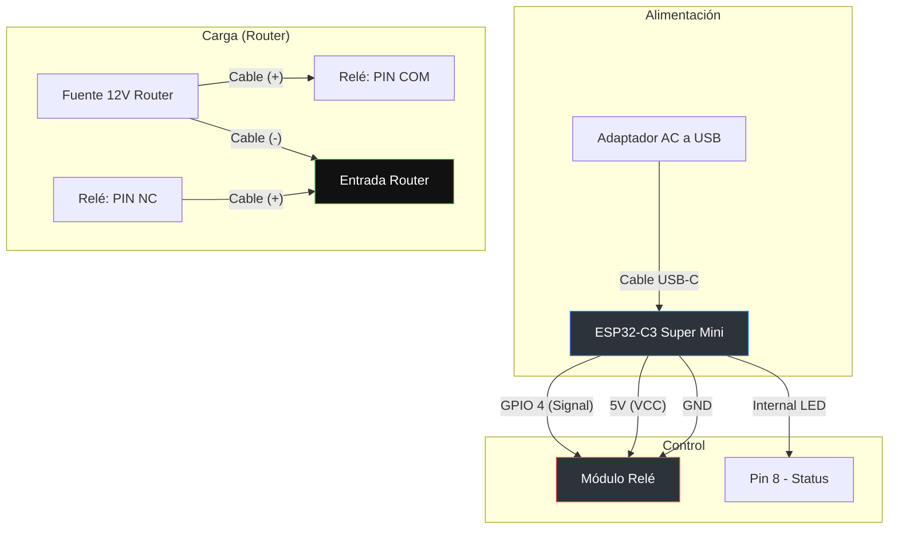

# ESP32 Router Monitor & Auto-Reset V2

Este proyecto utiliza un **ESP32** para monitorear la estabilidad de la conexión a Internet y realizar un ciclo de encendido (power cycle) al router de forma automática mediante un relé en caso de falla. 

Además, incluye funciones avanzadas de gestión remota como un panel web, notificaciones por Telegram y Wake-on-LAN.

## Características Principales

* **Monitoreo Inteligente:** Chequeo programado cada 1 hora. Realiza 3 pruebas de conectividad antes de decidir un reinicio.
* **Auto-Reset Robusto:** Si detecta caída, espera 60 segundos (permitiendo cancelación manual) y apaga el router por 25 segundos.
* **Servidor NTP Local:** Sincroniza la hora mediante un servidor NTP local (compatible con GPS) para mantener logs precisos incluso sin internet.
* **Dashboard Web:** Interfaz en tiempo real para visualizar estados, logs y realizar reinicios manuales.
* **Notificaciones Telegram:** Alertas instantáneas sobre el estado del WiFi, caídas de internet y reinicios ejecutados.
* **Watchdog (WDT):** Sistema de seguridad por hardware que reinicia el ESP32 si el código se bloquea.
* **Wake-on-LAN (WOL):** Permite encender computadoras de la red local desde el panel web.

## Hardware Necesario

1.  **ESP32** (Cualquier variante compatible).
2.  **Módulo Relé** (Para controlar la alimentación del router).
3.  **LED de Estado** (Indicador visual de reinicio).
4.  **Fuente de poder 5V** para el ESP32.

## Configuración e Instalación

1.  Abre el código en el IDE de Arduino o VS Code (PlatformIO).
2.  Instala las librerías necesarias (vienen por defecto en el core de ESP32).
3.  Modifica las variables de configuración en el código:
    * `ssid` y `password` de tu red.
    * `BOT_TOKEN` y `CHAT_ID` de tu Bot de Telegram.
    * `ntpServer` con la IP de tu servidor de hora.
    * `WOL_MAC` con la dirección física del dispositivo a despertar.
4.  Configura los pines `RELAY_PIN` y `LED_PIN` según tu conexión física.

## Panel Web
El monitor crea un servidor web en la IP fija asignada. Desde allí puedes:
* Ver el historial de los últimos 50 eventos con marca de tiempo.
* Monitorear la potencia de la señal WiFi (RSSI).
* Cancelar un reinicio automático inminente.
* Enviar un paquete "Magic Packet" (WOL).

## Diagrama de conexiones

---
## Código

```C++
#include <WiFi.h>
#include <WebServer.h>
#include <WiFiUdp.h>
#include <HTTPClient.h>
#include <esp_task_wdt.h>
#include "time.h"

// ================= CONFIGURACIÓN =================
#define WDT_TIMEOUT 20 
#define LOG_SIZE 50

// NTP LOCAL (ESP32 + GPS)
const char* ntpServer = "192.168.X.X"; // IP de tu servidor NTP
const long  gmtOffset_sec = -14400;     // UTC-4
const int   daylightOffset_sec = 0; 

// TELEGRAM
String BOT_TOKEN = "TU_TELEGRAM_TOKEN";
String CHAT_ID   = "TU_CHAT_ID";

// WIFI
const char* ssid = "TU_SSID";
const char* password = "TU_PASSWORD";

IPAddress local_IP(192, 168, 0, 70);
IPAddress gateway(192, 168, 0, 1);
IPAddress subnet(255, 255, 255, 0);

// HARDWARE
#define RELAY_PIN 4  // Pin de control del relé
#define LED_PIN 8    // LED interno ESP32-C3 Super Mini
#define RELAY_ON LOW // Depende de tu módulo relé (Low Level Trigger)
#define RELAY_OFF HIGH

// ESTADOS
enum RouterState {ON, REBOOTING};
RouterState state = ON;
unsigned long lastCheck = 0;
const unsigned long checkInterval = 3600000; 

// ... (Resto de la lógica que desarrollamos antes)

void setup() {
  // Configuración Watchdog
  esp_task_wdt_config_t wdt_config = {
    .timeout_ms = WDT_TIMEOUT * 1000,
    .idle_core_mask = (1 << portNUM_PROCESSORS) - 1,
    .trigger_panic = true
  };
  esp_task_wdt_init(&wdt_config);
  esp_task_wdt_add(NULL);

  pinMode(RELAY_PIN, OUTPUT);
  pinMode(LED_PIN, OUTPUT);
  
  digitalWrite(RELAY_PIN, RELAY_ON); // Router encendido por defecto
  digitalWrite(LED_PIN, LOW);

  connectWiFi();
  setupWeb();
  // ...
}

void loop() {
  esp_task_wdt_reset();
  server.handleClient();
  checkInternetLogic();
  autoResetLogic();
  updateRouter();
}
```
## Interfaz Web


*Desarrollado por Carlos Salas - 2026*
